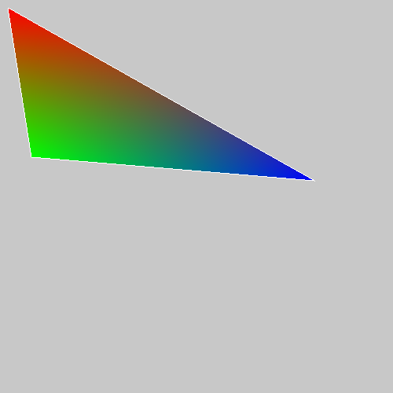
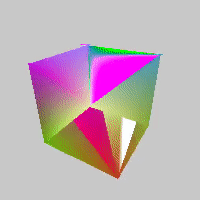
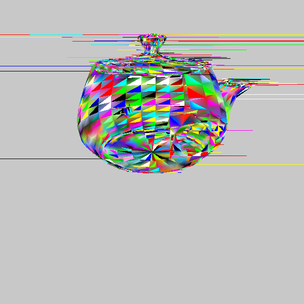

# Software renderer

Sept 2016

This is a software 3D renderer with a perspective camera made from scratch 
without using any libraries (except numpy for linear algebra), done for 
educational purposes. It follows mathematical derivations mostly out of the 
textbooks [Computer Graphics Principles and 
Practice](https://www.amazon.com/John-F-Hughes/dp/0321399528/ref=sr_1_1) and 
[Interactive Computer Graphics: A Top-Down 
Approach](https://www.amazon.com/Interactive-Computer-Graphics-Top-Down-Shader-Based/dp/0132545233/ref=sr_1_3). 
Also implemented is a rudimentary OBJ and STL file parser.

# Issues

Rasterization is also implemented, though with bugs.

Given that a) this is purely educational (not a class assignment, personal game 
engine project, etc), b) I have no doubt these bugs could be fixed given some 
time and attention, and c) I'm now satisfied with my understanding of 
rasterization (though with a respect for its nuance), which was the whole 
point, I doubt I'll ever get around to addressing these issues.

